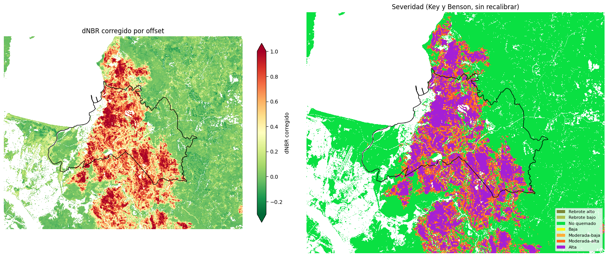
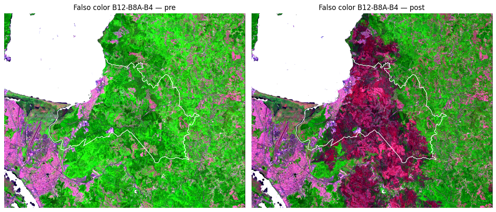
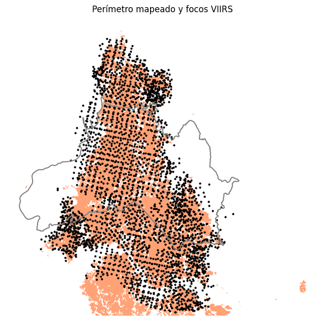

# Área quemada y severidad del incendio Penco–Lirquén con Sentinel-2

[Repositorio en GitHub](https://github.com/Zelaznog-J/incendio-penco-sentinel2){ .md-button .md-button--primary }

## Resumen

El 17 de enero de 2026 comenzó un incendio forestal en la comuna de Penco (Región del Biobío) que avanzó sobre plantaciones, matorral y zonas urbanas de Penco y Lirquén. El proyecto estima la superficie quemada y su severidad con datos abiertos y sin descargar archivos: escenas Sentinel-2 L2A consultadas por STAC, límites de Overture Maps, cobertura ESA WorldCover y focos de calor NASA FIRMS. El notebook está escrito como material didáctico: cada paso explica el objetivo, el concepto, la decisión tomada y cómo leer el resultado.

| Aspecto | Detalle |
| --- | --- |
| Fuente | Sentinel-2 L2A (Earth Search, STAC), 14 escenas previas y 17 posteriores al incendio |
| Área de análisis | Comuna de Penco y buffer de 5 km (EPSG:32718) |
| Índices | NBR, dNBR corregido por offset, RdNBR y RBR |
| Clasificación | Umbral de Otsu y severidad según Key y Benson (2006) |
| Validación | Focos de calor VIIRS (NASA FIRMS) |
| Herramientas | Python con pystac-client, odc-stac, xarray, rioxarray, Dask, DuckDB, GeoPandas y scikit-image |

!!! success "Hallazgo principal"
    En la comuna de Penco se quemaron **5 392 ha**, el 56,5 % de la vegetación analizada, y **12 131 ha** si se incluye el buffer de 5 km. Cerca del 90 % del área quemada de la comuna tuvo severidad moderada-alta o alta. El 96,6 % de los focos VIIRS cae dentro del perímetro mapeado.

{ width="720" }

## Objetivos

1. Estimar cuánta superficie se quemó y dónde.
2. Clasificar con qué severidad se quemó.
3. Elegir el umbral quemado/no quemado de forma objetiva y medir cuánto condiciona el resultado.
4. Validar el perímetro con una fuente independiente.
5. Dejar el análisis reproducible: IDs de escenas, parámetros y productos en formatos abiertos.

## Flujo de trabajo

1. **Área de interés.** Polígono de Penco desde Overture Maps (DuckDB sobre GeoParquet en S3, release fijada) y buffer de 5 km en UTM.
2. **Búsqueda de escenas.** Catálogo STAC con ventanas de un mes antes y después del incendio, para tener varias observaciones despejadas por píxel.
3. **Máscara de nubes por píxel.** Con la banda SCL, escena por escena, en vez de descartar escenas completas.
4. **Índices y compuestos.** NBR, NBR2 y NDVI por fecha y luego mediana, de modo que cada valor viene de una observación real.
5. **Máscara de vegetación.** WorldCover, NDVI previo y exclusión de cosechas anteriores al fuego.
6. **dNBR corregido.** Se resta el offset estacional estimado en píxeles claramente no quemados y se contrasta con un verano de referencia sin incendio.
7. **Umbral y perímetro.** Otsu, unidad mínima de mapeo de 0,5 ha y tabla de sensibilidad.
8. **Severidad y validación.** Clases Key y Benson, y comparación con focos VIIRS.
9. **Exportación.** COG, GeoPackage, CSV y `metadatos.json`.

{ width="720" }

## Resultados

| Clase de severidad | Hectáreas (comuna) | % de la vegetación analizada |
| --- | ---: | ---: |
| No quemado | 4 162 | 43,6 |
| Baja | 7 | 0,1 |
| Moderada-baja | 529 | 5,5 |
| Moderada-alta | 1 798 | 18,8 |
| Alta | 3 044 | 31,9 |

| Umbral de dNBR | Área quemada en la comuna (ha) |
| --- | ---: |
| 0,10 (Key y Benson, baja) | 6 607 |
| 0,20 | 6 072 |
| 0,27 (Key y Benson, moderada-baja) | 5 779 |
| 0,36 (Otsu, usado) | 5 345 |

{ width="460" }

## Decisiones técnicas

- **El carbón no se enmascara.** La clase SCL «área oscura» pasó de 0,09 % a 4,92 % de las observaciones tras el incendio: es superficie carbonizada, así que se mantuvo en el análisis.
- **Índice primero, mediana después.** Evita combinar el NIR de una fecha con el SWIR de otra.
- **Corrección de offset.** El dNBR de fondo es de centésimas (+0,02 en 2026 y −0,01 en el verano de referencia), pequeño frente a valores sobre 0,3 en el área quemada, pero documentarlo hace el resultado más defendible.
- **Otsu más tabla de sensibilidad.** Otsu se adapta a este incendio, pero es conservador; el área cambia cerca de un 20 % según el umbral, por eso se reporta siempre junto con él.

## Limitaciones

- Los límites de severidad de Key y Benson no están calibrados para plantaciones de pino y eucalipto del Biobío; requieren datos de campo (CBI).
- Los focos de calor solo detectan omisiones gruesas: no hay exactitud ni intervalo de confianza medidos con muestras de referencia.
- Las zonas urbanas quedan fuera por diseño, así que las viviendas quemadas no se cuantifican.
- Con resoluciones de 10 a 20 m, los bordes y parches pequeños tienen más incertidumbre.
