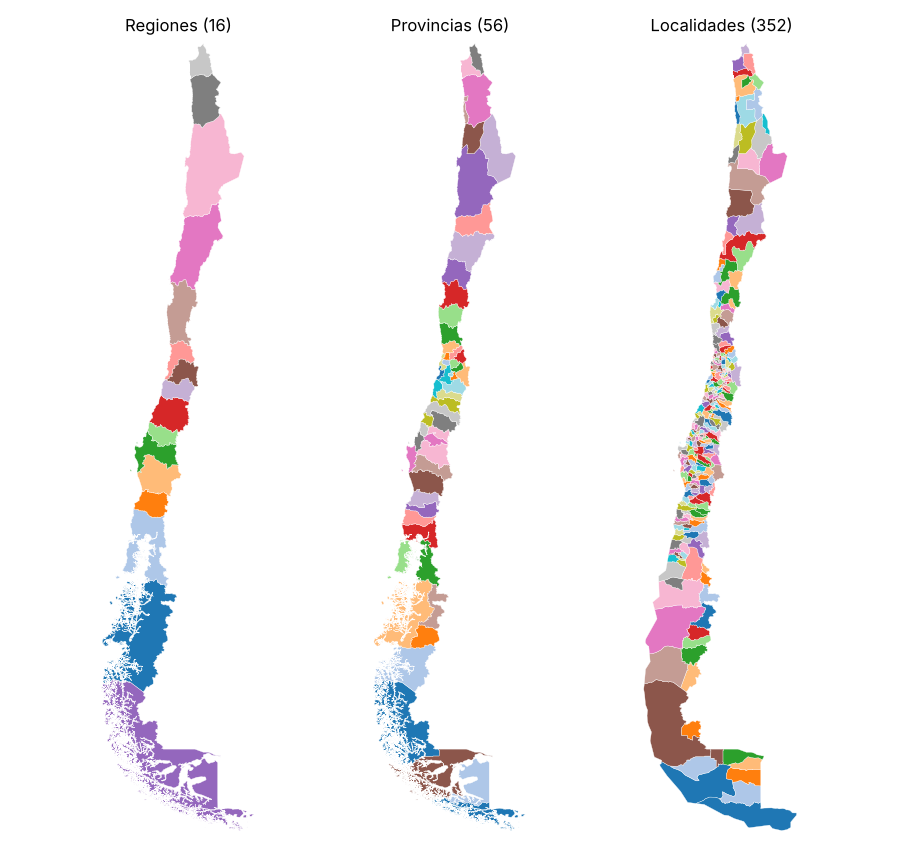

# Límites administrativos de Chile con Overture Maps

[Repositorio en GitHub](https://github.com/Zelaznog-J/adm_bounds_overture){ .md-button .md-button--primary }

## Resumen

El proyecto extrae los límites administrativos de Chile desde Overture Maps con un flujo reproducible basado solo en DuckDB, que lee los GeoParquet directamente desde S3. Parte de un reconocimiento visual en Overture Explorer y termina con un archivo por nivel administrativo en GeoJSON y GeoPackage. Esos límites son la máscara de Chile de la serie *Exploring ERA5*.

| Aspecto | Detalle |
| --- | --- |
| Fuente | Overture Maps, tema `divisions`, tipo `division_area` (polígonos) |
| Acceso | DuckDB con `httpfs` y `spatial`, consultando S3 sin descarga previa |
| Filtro | `country = 'CL'` y `class = 'land'`, sin bbox para incluir las islas |
| Salida | GeoJSON y GeoPackage por `subtype`, en EPSG:4326 |
| Herramientas | Python con DuckDB, GeoPandas, shapely, matplotlib y folium |

!!! success "Hallazgo principal"
    Overture entrega **16 regiones y 56 provincias**, completas. El nivel comunal viene como `locality`, no como `localadmin`: asumir `localadmin` devuelve cero comunas.

{ width="520" }

## Objetivos

1. Entender qué tipos trae el tema `divisions` y cuál contiene los límites.
2. Consultar los datos remotos sin descargarlos completos.
3. Extraer todos los niveles administrativos de Chile, islas incluidas.
4. Visualizarlos de forma estática e interactiva.
5. Exportarlos por nivel en formatos listos para web y para QGIS.

## Flujo de trabajo

1. **Reconocimiento.** Overture Explorer para confirmar nombres de campos y valores.
2. **Release y conexión.** Se lista el bucket público y se fija una release; DuckDB se conecta a S3.
3. **Esquema.** `DESCRIBE` sobre el Parquet remoto, sin leer geometrías.
4. **Inventario.** Un `GROUP BY subtype, class` liviano muestra qué niveles existen para Chile.
5. **Extracción.** Filtro en SQL y geometría a WKB con `ST_AsWKB`, cargada en un `GeoDataFrame`.
6. **Visualización.** Mapa estático por `subtype` y mapa interactivo con `explore()`.
7. **Exportación.** Un GeoJSON y un GeoPackage por nivel.

## Resultados

| `subtype` | Equivalente en Chile | Polígonos |
| --- | --- | ---: |
| `country` | País | 1 |
| `region` | Regiones | 16 |
| `county` | Provincias | 56 |
| `locality` | Comunas (aprox.) | 352 |
| `neighborhood` | Barrios (cobertura parcial) | 390 |
| `microhood` | Microbarrios | 110 |
| `macrohood` | Macrobarrios | 1 |

## Decisiones técnicas

- **Filtrar por atributo y no por bbox**, para no perder Isla de Pascua ni Juan Fernández.
- **Solo límites terrestres**, porque los polígonos marítimos se superponen con los de tierra.
- **Geometría en WKB desde SQL**, para pasar a GeoPandas sin archivos intermedios.
- **Release fijada.** El notebook toma la más reciente; para reproducir un resultado exacto se fija a mano.

## Limitaciones

- Las 352 `locality` no calzan 1:1 con las 346 comunas oficiales. Antes de usarlas como comunas hay que validarlas contra la división oficial (BCN/INE).
- Los barrios tienen cobertura parcial: dependen de lo que aporte OpenStreetMap en cada zona.
- Los datos derivados exigen atribución a Overture Maps Foundation y sus fuentes (ODbL / CDLA-Permissive-2.0).
