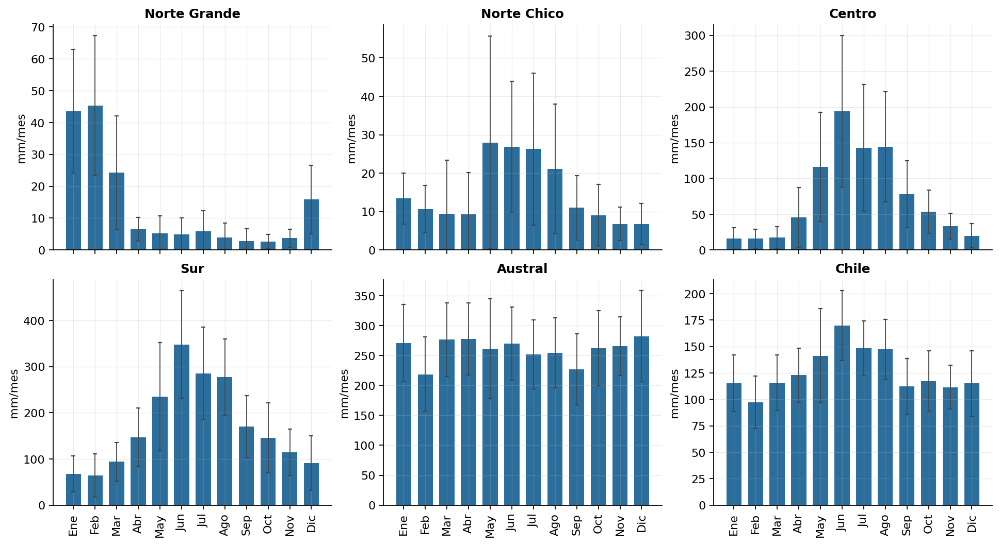
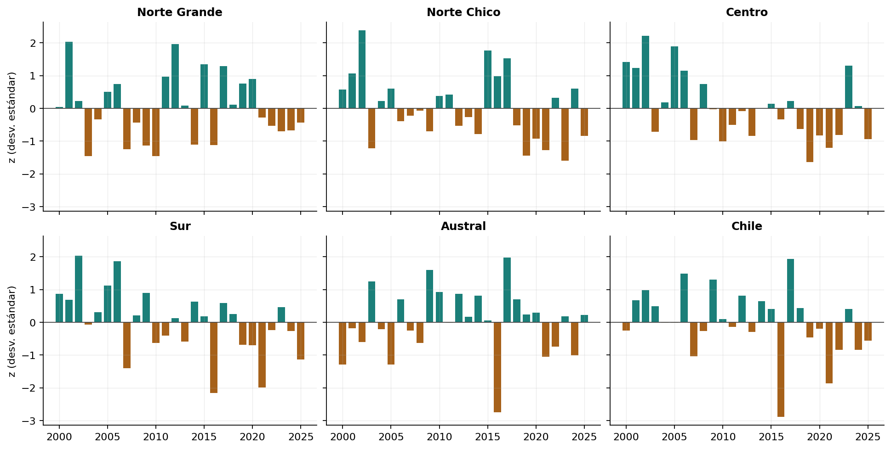
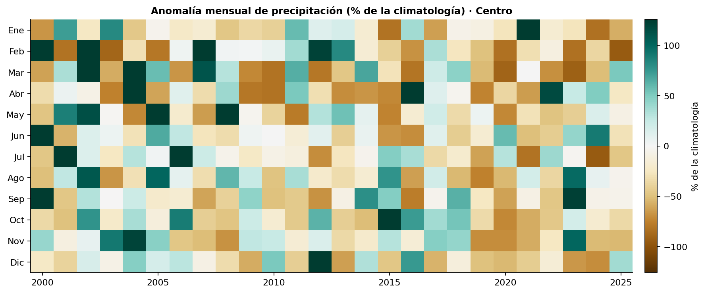

# Precipitación en Chile 2000–2025 con ERA5

[Repositorio en GitHub](https://github.com/Zelaznog-J/exploring-era5-chile){ .md-button .md-button--primary }

## Resumen

El proyecto convierte 26 años de precipitación diaria ERA5 (2000–2025) en totales mensuales, estacionales y anuales, índices de extremos y tendencias para Chile continental. Es la segunda etapa de la serie *Exploring ERA5*: parte de la precipitación diaria extraída desde ARCO-ERA5 en Google Cloud y la procesa en un notebook de agregación.

| Aspecto | Detalle |
| --- | --- |
| Fuente | ERA5 (ARCO, Google Cloud), variable `tp_suma` en mm/día |
| Período | 2000-01-01 a 2025-12-31 (9.497 días, sin faltantes) |
| Grilla | 0,25° (~25 km), 157 × 45 celdas; 1.254 celdas dentro de Chile |
| Unidades espaciales | 5 zonas por latitud (Norte Grande, Norte Chico, Centro, Sur, Austral), total Chile y 9 ciudades de Arica a Punta Arenas |
| Herramientas | Python con xarray, Dask, geopandas, shapely, scipy y matplotlib |

!!! success "Hallazgo principal"
    Entre 2000 y 2025 la precipitación cae de forma significativa en Chile central y sur: el **Centro pierde 147 mm/década (−17 %)** y el **Sur 191 mm/década (−9 %)**, ambos con p = 0,01.

{ width="420" }

## Objetivos

1. Agregar la precipitación diaria en el tiempo: totales mensuales, estacionales (DJF, MAM, JJA, SON), anuales y por año hidrológico (abril–marzo).
2. Calcular índices de extremos tipo ETCCDI: R1mm, SDII, R10mm, R20mm, Rx1day, Rx5day, CDD y R95pTOT.
3. Construir climatologías 2000–2025 y anomalías absolutas (mm), relativas (%) y estandarizadas (z).
4. Agregar en el espacio: medias ponderadas por área por zona y series de la celda más cercana a cada ciudad.
5. Estimar tendencias lineales del total anual (mm/década) con su significancia estadística.
6. Entregar productos reutilizables (NetCDF, CSV y figuras) y practicar un flujo eficiente con Dask.

## Flujo de trabajo

El notebook sigue 11 secciones. Las secciones 2 a 6 solo arman grafos perezosos de Dask; el cálculo ocurre una vez por producto en la sección 7.

1. **Configuración.** Parámetros centralizados (rutas, umbrales, zonas, ciudades) y un cluster Dask local de 8 hilos.
2. **Lectura y control de calidad.** Apertura perezosa con un solo bloque en el tiempo. Chequeo de días faltantes, negativos y NaN: 0 faltantes, rango 0–219,5 mm/día. Máscara de Chile con el GeoJSON de 16 regiones (Overture Maps) y `shapely.intersects_xy`.
3. **Agregación temporal.** Suma (nunca promedio) por mes, estación, año y año hidrológico, conservando solo períodos completos: 312 meses, 103 estaciones, 26 años y 25 años hidrológicos.
4. **Índices de extremos.** Día húmedo ≥ 1 mm; Rx5day exige la ventana dentro del año; CDD con una función vectorizada vía `apply_ufunc`; R95pTOT sobre el percentil 95 de días húmedos.
5. **Climatologías y anomalías.** Medias 2000–2025 por mes, estación y año; anomalía % solo donde la climatología es ≥ 1 mm/mes, para evitar divisiones casi por cero en el desierto.
6. **Agregación espacial.** Media ponderada por cos(latitud) en cada zona; ciudades con la celda más cercana sin máscara, para no perder ciudades costeras.
7. **Cómputo y guardado.** Cinco NetCDF (mensual, estacional, anual, hidrológico y climatologías). Calcular en memoria antes de escribir resultó unas 10 veces más rápido que escribir desde Dask.
8. **Validación.** Conservación de masa (error máximo meses vs año: 0,007 mm en 26 años), estaciones vs meses en 25 años, coherencia espacial e índices coherentes (R10mm ≤ R1mm, Rx1day ≤ Rx5day ≤ total).
9. **Visualizaciones.** Nueve figuras: mapas de climatología, ciclo anual por zona, anomalías, heatmap año × mes, climogramas de ciudades, mapas de extremos y serie diaria de Concepción.
10. **Tendencias.** Regresión lineal por celda y por zona en mm/década, con valor p (t de Student, n−2 g.l.).
11. **Resumen y exportación.** Tabla por zona y series de zonas y ciudades en CSV.

## Resultados

| Zona | Media anual (mm) | CV (%) | Tendencia (mm/década) | Tendencia (%/década) | p | % en invierno (JJA) | Año más húmedo | Año más seco |
| --- | ---: | ---: | ---: | ---: | ---: | ---: | :---: | :---: |
| Norte Grande | 165 | 27 | −5 | −3,1 | 0,68 | 9 | 2001 | 2010 |
| Norte Chico | 179 | 30 | −25 | −14,1 | 0,08 | 42 | 2002 | 2023 |
| Centro | 877 | 24 | **−147** | **−16,8** | **0,01** | 55 | 2002 | 2019 |
| Sur | 2.038 | 14 | **−191** | **−9,4** | **0,01** | 45 | 2002 | 2016 |
| Austral | 3.120 | 8 | +1 | 0,0 | 0,99 | 25 | 2017 | 2016 |
| Chile | 1.514 | 8 | −50 | −3,3 | 0,10 | 31 | 2017 | 2016 |

### Gradiente norte–sur

La media anual crece unas 19 veces desde el Norte Grande (165 mm) hasta el Austral (3.120 mm). Entre ciudades, va de 103 mm/año en La Serena a 2.350 mm/año en Puerto Montt. La variabilidad interanual va en sentido contrario: el CV baja de 27–30 % en el norte a 8 % en el Austral, y La Serena es la ciudad más variable (CV 56 %, entre 19 mm en 2023 y 241 mm en 2002).

### Regímenes estacionales opuestos

El Centro concentra el 55 % de su lluvia en invierno (JJA). El Norte Grande recibe el 63 % en verano (DJF), por el invierno altiplánico. El Austral reparte la lluvia de forma pareja (~25 % por estación).

### Megasequía central

El total del Centro en 2010–2025 es 24 % menor que en 2000–2009. 2019 fue el año más seco (531 mm, 39 % menos que la media), y Santiago registró 234 mm ese año frente a 495 mm de promedio. 2002 fue el año más húmedo en Norte Chico, Centro y Sur, y 2016 el más seco en Sur, Austral y Chile en total (1.186 mm).

### Señal espacial

El 27,7 % de las celdas de Chile (347 de 1.254) tiene tendencia significativa (p < 0,05), casi todas negativas y entre ~30°S y ~41°S. Magallanes muestra tendencias levemente positivas, no significativas.

## Validación

Los totales se conservan entre escalas con un error máximo de 0,007 mm, y todos los índices son coherentes entre sí (R10mm ≤ R1mm, Rx1day ≤ Rx5day ≤ total anual).

!!! warning "Limitaciones"
    - En el **desierto costero** ERA5 entrega valores muy por encima de lo que registran las estaciones (Arica 294 mm/año y Antofagasta 154 mm/año en la celda más cercana, frente a pocos mm/año observados, cifra aproximada).
    - Con **26 años**, las tendencias son una primera señal y no una atribución.

---

Datos: ERA5 (Hersbach et al., 2020), información modificada del Copernicus Climate Change Service, vía [ARCO-ERA5](https://github.com/google-research/arco-era5). Límites de Chile: [Overture Maps](https://overturemaps.org/).
