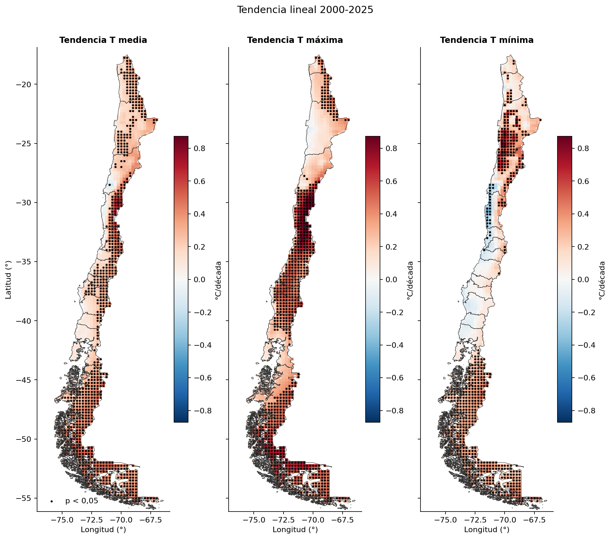
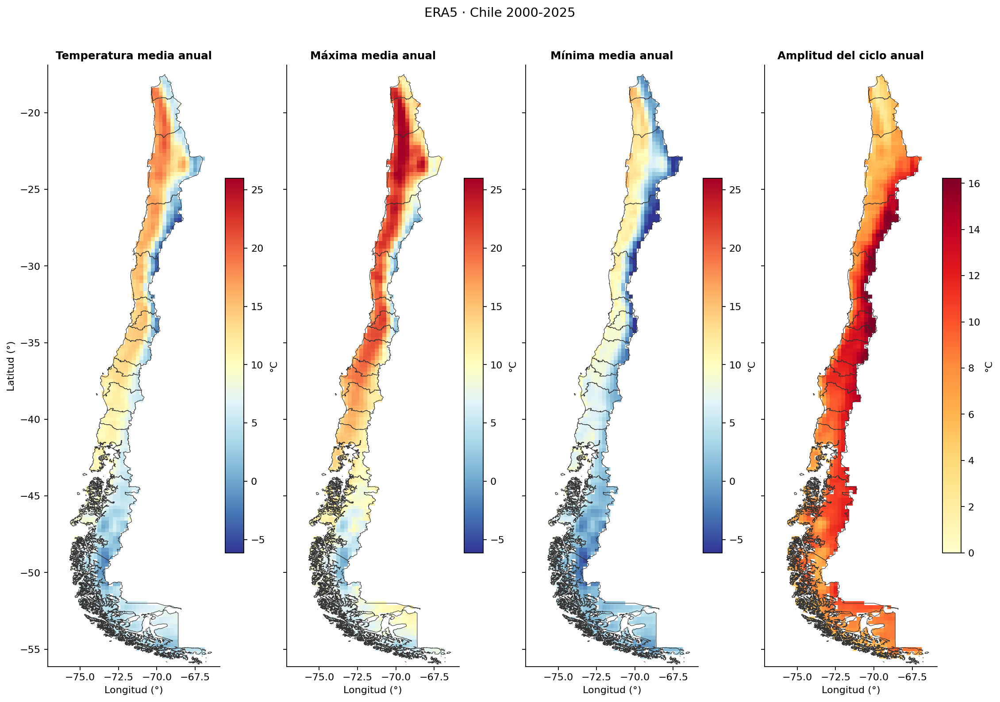
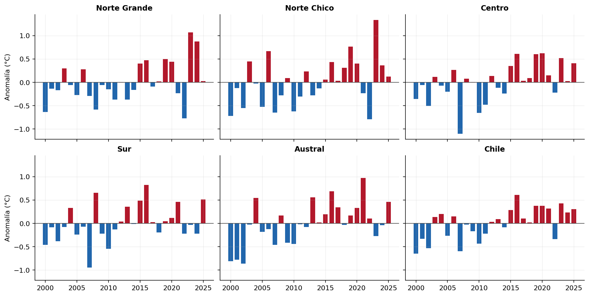
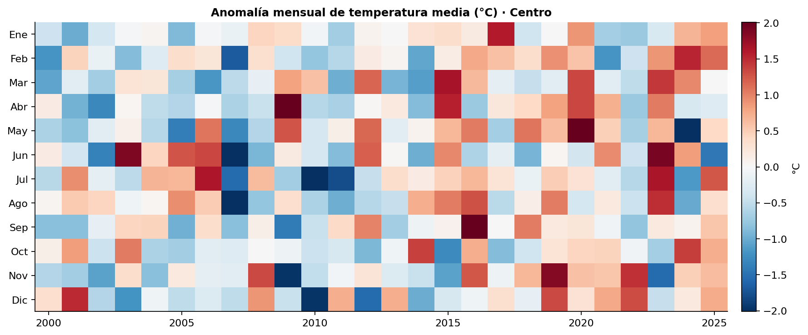
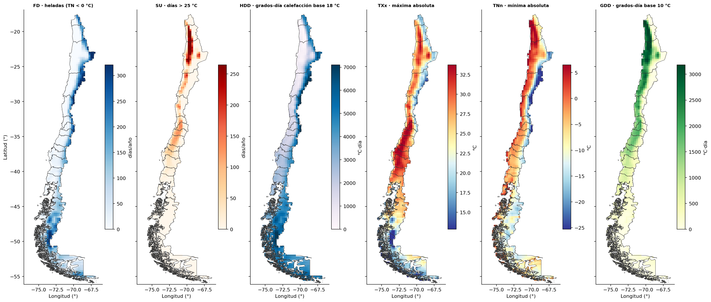

# Temperatura en Chile 2000–2025 con ERA5

[Repositorio en GitHub](https://github.com/Zelaznog-J/exploring-era5-chile){ .md-button .md-button--primary }

## Resumen

El proyecto convierte 26 años de temperatura diaria a 2 m de ERA5 (2000–2025) en medias mensuales, estacionales y anuales, índices de extremos, grados-día y tendencias para Chile continental. Es la tercera etapa de la serie *Exploring ERA5*: parte de la temperatura diaria extraída desde ARCO-ERA5 en Google Cloud y la procesa en un notebook de agregación.

| Aspecto | Detalle |
| --- | --- |
| Fuente | ERA5 (ARCO, Google Cloud), variables `t2m_media`, `t2m_max` y `t2m_min` en °C, más la amplitud térmica diaria (`dtr = tmax − tmin`) |
| Período | 2000-01-01 a 2025-12-31 (9.497 días; 312 meses, 103 estaciones y 26 años completos) |
| Grilla | 0,25° (~25 km), 157 × 45 celdas; 1.254 celdas dentro de Chile |
| Unidades espaciales | 5 zonas por latitud (Norte Grande, Norte Chico, Centro, Sur, Austral), total Chile y 9 ciudades de Arica a Punta Arenas |
| Herramientas | Python con xarray, Dask, flox, geopandas, shapely, scipy y matplotlib |

!!! success "Hallazgo principal"
    Entre 2000 y 2025 Chile se calienta **0,27 °C por década (p = 0,001)**, y las máximas suben casi el doble que las mínimas. En el Centro la máxima sube **0,53 °C/década** mientras la mínima casi no cambia.

{ width="520" }

## Objetivos

1. Agregar la temperatura diaria en el tiempo: medias mensuales, estacionales (DJF, MAM, JJA, SON) y anuales de la media, la máxima, la mínima y la amplitud diaria.
2. Calcular índices de extremos tipo ETCCDI: TXx, TXn, TNx, TNn, FD (heladas), ID (días de hielo), SU (días > 25 °C), TR (noches tropicales), TX90p, TN10p y rachas máximas de días cálidos y de heladas.
3. Calcular grados-día de crecimiento (GDD, base 10 °C) y de calefacción (HDD, base 18 °C), útiles para agricultura y energía.
4. Construir climatologías 2000–2025, anomalías absolutas (°C) y estandarizadas (z), y la amplitud del ciclo anual.
5. Agregar en el espacio: medias ponderadas por área por zona y series de la celda más cercana a cada ciudad.
6. Estimar tendencias lineales de las temperaturas anuales (°C/década) con su significancia estadística.
7. Entregar productos reutilizables (NetCDF, CSV y figuras) con el mismo flujo Dask del proyecto de precipitación.

## Flujo de trabajo

El notebook sigue 11 secciones. Las secciones 2 a 6 solo arman grafos perezosos de Dask; el cálculo ocurre una vez por producto en la sección 7.

1. **Configuración.** Parámetros centralizados (rutas, umbrales ETCCDI, bases de grados-día, zonas, ciudades) y un cluster Dask local de 8 hilos.
2. **Lectura y control de calidad.** Apertura perezosa con un solo bloque en el tiempo. Chequeo de días faltantes, rango físico plausible (−60 a +50 °C), NaN y coherencia diaria `tmin ≤ tmedia ≤ tmax`. Máscara de Chile con el GeoJSON de 16 regiones (Overture Maps) y `shapely.intersects_xy`.
3. **Agregación temporal.** Promedio (nunca suma) por mes, estación y año, conservando solo períodos completos. No se calcula año hidrológico porque para temperatura no tiene sentido físico.
4. **Índices y grados-día.** Extremos con máximo y mínimo, conteos de días con suma. TX90p y TN10p usan percentiles por mes calendario (simplificación de la ventana de 5 días de ETCCDI). Las rachas se calculan con una función vectorizada vía `apply_ufunc` que no cruza el cambio de año.
5. **Climatologías y anomalías.** Medias 2000–2025 por mes, estación y año; anomalías en °C y estandarizadas (no en %, porque la escala en °C no tiene un cero útil).
6. **Agregación espacial.** Media ponderada por cos(latitud) en cada zona; ciudades con la celda más cercana sin máscara, para no perder ciudades costeras.
7. **Cómputo y guardado.** Cuatro NetCDF: mensual, estacional, anual con índices y climatologías. Cada producto se calcula en memoria antes de escribirse, que es mucho más rápido que escribir desde Dask.
8. **Validación.** Media de meses ponderada por días igual a la media anual, estaciones iguales a meses, orden físico (`tmin ≤ tmedia ≤ tmax`, `TNn ≤ tmin`, `tmax ≤ TXx`), media de Chile dentro del rango de las zonas e índices coherentes.
9. **Visualizaciones.** Nueve figuras: mapas de climatología, ciclo anual por zona, anomalías, heatmap año × mes del Centro, ciclo anual de ciudades, mapas de extremos y grados-día, mapas de tendencia y serie diaria de Santiago.
10. **Tendencias.** Regresión lineal por celda y por zona en °C/década para la media, la máxima y la mínima, con valor p (t de Student, n−2 g.l.), sin bucles por celda (`xarray.cov` y `xarray.corr`).
11. **Resumen y exportación.** Tabla por zona y series de zonas, índices y ciudades en CSV (UTF-8 con BOM, compatible con Excel).

## Resultados

| Zona | T media (°C) | T máx (°C) | T mín (°C) | Tendencia T media (°C/década) | Tendencia T máx (°C/década) | Tendencia T mín (°C/década) | Heladas (días/año) | Año más cálido | Año más frío |
| --- | ---: | ---: | ---: | ---: | ---: | ---: | ---: | :---: | :---: |
| Norte Grande | 12,4 | 19,1 | 6,5 | **+0,24** (p = 0,03) | +0,20 (p = 0,11) | **+0,27** (p = 0,02) | 73 | 2023 | 2022 |
| Norte Chico | 9,6 | 15,1 | 4,6 | **+0,27** (p = 0,04) | **+0,43** (p = 0,009) | +0,20 (p = 0,12) | 103 | 2023 | 2022 |
| Centro | 10,8 | 16,6 | 5,7 | **+0,27** (p = 0,009) | **+0,53** (p < 0,001) | +0,03 (p = 0,79) | 66 | 2020 | 2007 |
| Sur | 9,9 | 14,5 | 5,9 | +0,17 (p = 0,09) | **+0,36** (p = 0,008) | +0,01 (p = 0,88) | 42 | 2016 | 2007 |
| Austral | 5,2 | 8,0 | 2,6 | **+0,34** (p = 0,002) | **+0,41** (p = 0,003) | **+0,29** (p = 0,002) | 99 | 2021 | 2002 |
| Chile | 9,0 | 13,8 | 4,7 | **+0,27** (p = 0,001) | **+0,37** (p < 0,001) | **+0,20** (p = 0,01) | 81 | 2016 | 2000 |

En negrita, tendencias significativas (p < 0,05).

### Gradientes marcados

La media anual va de −5,4 °C en la cordillera de Atacama (~27°S) a 20,9 °C en el desierto interior (~22°S). La amplitud del ciclo anual va de 1,8 °C en la costa a 18,8 °C en el interior. Entre ciudades, la media va de 18,8 °C en Arica a 5,6 °C en Punta Arenas, y la amplitud diaria de 2,0 °C en Antofagasta a 12,6 °C en Santiago.

### Calentamiento generalizado

El 98 % de las celdas de Chile tiene tendencia positiva en la temperatura media, y el 59,2 % (742 de 1.254) es significativa, todas salvo una positivas. La década 2016–2025 es 0,45 °C más cálida que 2000–2009. Desde 2015, 10 de 11 años quedaron sobre el promedio (solo 2022 bajo él), frente a 5 de 15 en 2000–2014. 2016 fue el año más cálido de Chile (+0,61 °C), 2007 el más frío en el Centro (−1,1 °C) y 2023 el más cálido en el norte (+1,3 °C en el Norte Chico), años que coinciden con los eventos El Niño de 2015–16 y 2023 y La Niña de 2007.

### Las máximas suben más que las mínimas

En el Centro y el Sur las mínimas no cambian, así que la amplitud térmica diaria crece 0,50 y 0,35 °C/década (p < 0,001). La señal más fuerte está en verano: la máxima de DJF sube 0,65 °C/década en el Centro y 0,60 en el Sur. En la celda de Santiago la máxima sube 0,73 °C/década y la mínima −0,02.

En la costa entre ~28,5°S y ~34°S, 26 celdas muestran una mínima que se **enfría** de forma significativa. En La Serena la mínima baja 0,36 °C/década (p = 0,008) mientras la máxima sube 0,41. El Austral es el calentamiento más parejo: máxima y mínima suben casi igual, y pierde 7,5 días de helada por década (p = 0,003).

### Extremos, grados-día y su impacto

La fracción de días sobre el percentil 90 (TX90p) sube 3,0 puntos por década en Chile y 4,5 en el Centro, desde una base de 10 %. El Centro suma 10 días > 25 °C por década y su máxima absoluta anual (TXx) sube 0,95 °C/década. Las noches frías (TN10p) no muestran cambio significativo en ninguna zona.

Los grados-día de crecimiento del Centro suben 63 °C·día por década, y los de calefacción bajan 92 °C·día por década en el total de Chile (126 en el Austral).

## Validación

Las medias se conservan entre escalas (meses vs año y estaciones vs meses, tolerancia de 0,001 °C), y el orden físico y los índices son coherentes en todas las celdas.

!!! warning "Limitaciones"
    - Cada zona mezcla costa, valle y cordillera, así que su media depende de la fracción de celdas andinas (por eso el Norte Chico parece más frío que el Centro).
    - Una celda de ~25 km no representa una estación puntual, y en la costa la celda mixta mar-tierra suaviza la amplitud diaria.
    - El día ERA5 es UTC (~20 a 20 h en Chile).
    - Con **26 años**, las tendencias son una primera señal y no una atribución.

---

Datos: ERA5 (Hersbach et al., 2020), información modificada del Copernicus Climate Change Service, vía [ARCO-ERA5](https://github.com/google-research/arco-era5). Límites de Chile: [Overture Maps](https://overturemaps.org/).
